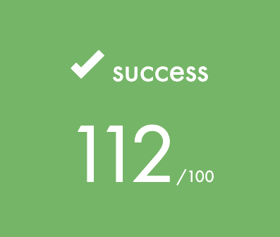

# School 21 'common core rank 1' projects

|Project |Description|Grade|
|-|-|-|
|libft|This project is about coding a C library. It will contain a lot of general purpose functions your programs will rely upon|
|get_next_line|This project is about programming a function that returns a line read from a file descriptor.|
|ft_printf|The goal of this project is pretty straightforward. You will recode printf(). You will mainly learn about using a variable number of arguments|